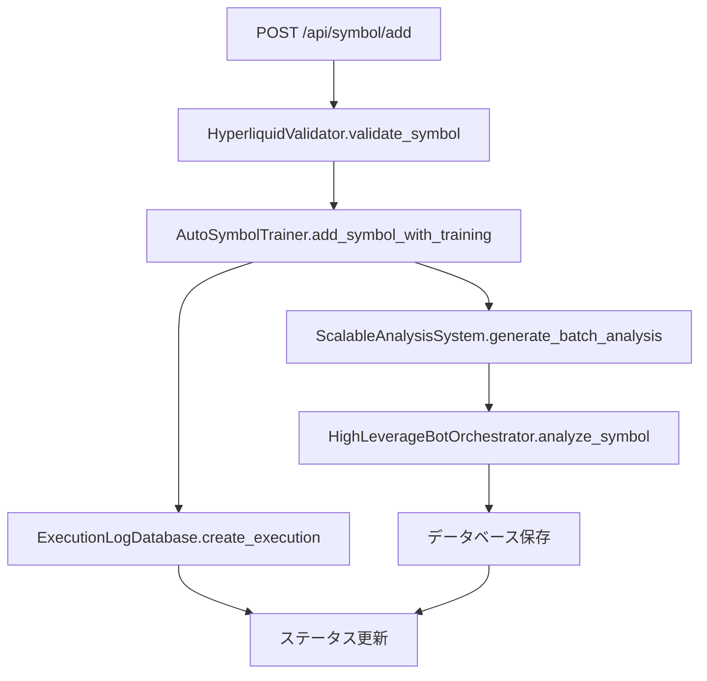

# Long Trader テストスイート

## 概要

Long Traderの銘柄追加パイプライン全体をカバーする包括的なテストスイートです。単体テストから統合テストまで、本番データと完全に分離されたテスト環境で実行されます。

## テスト構成

### 📁 ディレクトリ構造
```
tests/
├── __init__.py                          # テストパッケージ初期化
├── test_symbol_addition_pipeline.py     # 単体テストスイート
├── test_integration.py                  # 統合テストスイート  
├── run_tests.py                         # テスト実行スクリプト
├── temp_data/                           # テスト用一時データ
└── test_results/                        # テスト結果レポート
```

### 🧪 テスト種類

#### 1. 単体テスト (`test_symbol_addition_pipeline.py`)
- **ExecutionLogDatabase**: データベース操作テスト
- **HyperliquidValidator**: 銘柄バリデーションテスト
- **AutoSymbolTrainer**: 自動学習・バックテストテスト
- **ScalableAnalysisSystem**: スケーラブル分析テスト
- **WebAPI**: Web API エンドポイントテスト
- **データ分離**: 本番データとの分離確認テスト

#### 2. 統合テスト (`test_integration.py`)
- **完全パイプライン**: API → バリデーション → バックテスト → DB保存
- **エラーハンドリング**: 無効シンボル、データ不足、接続エラー対応
- **データ整合性**: フロー全体でのデータ一貫性確認

## 🚀 テスト実行方法

### 基本的な実行

```bash
# 全テスト実行
python tests/run_tests.py

# 単体テストのみ
python tests/run_tests.py --unit

# 統合テストのみ
python tests/run_tests.py --integration

# カバレッジ付きテスト
python tests/run_tests.py --coverage

# 詳細出力
python tests/run_tests.py --verbose
```

### 個別実行

```bash
# 単体テストを直接実行
python tests/test_symbol_addition_pipeline.py

# 統合テストを直接実行
python tests/test_integration.py

# 特定のテストクラスのみ
python -m unittest tests.test_symbol_addition_pipeline.TestExecutionLogDatabase
```

## 🛡️ テスト環境の分離

### データベース分離
- **本番DB**: `execution_logs.db`
- **テスト用DB**: `test_execution_logs.db`, `test_analysis.db`
- 自動クリーンアップでテスト後削除

### ディレクトリ分離
- **本番ディレクトリ**: `large_scale_analysis/`
- **テスト用ディレクトリ**: `tests/temp_data/`
- 一時ディレクトリで完全分離

### API呼び出しのモック化
- 外部API（Hyperliquid, Gate.io）は全てモック
- ネットワーク通信なし
- テストデータによる一貫した結果

## 📊 テスト対象関数

### 主要関数と依存関係

| 関数名 | 機能 | 入力 | 出力 | 依存関係 |
|--------|------|------|------|----------|
| `api_symbol_add` | Web API銘柄追加 | `{'symbol': 'HYPE'}` | `{'status': 'started', 'execution_id': str}` | HyperliquidValidator, AutoSymbolTrainer |
| `AutoSymbolTrainer.add_symbol_with_training` | 自動学習・バックテスト | `symbol: str, execution_id: str` | `execution_id: str` | ExecutionLogDatabase, ScalableAnalysisSystem |
| `HyperliquidValidator.validate_symbol` | 銘柄バリデーション | `symbol: str` | `{'valid': bool, 'symbol': str}` | MultiExchangeAPIClient |
| `ScalableAnalysisSystem.generate_batch_analysis` | バッチ分析 | `batch_configs: List[Dict]` | `processed_count: int` | ProcessPoolExecutor, SQLite |
| `ExecutionLogDatabase.create_execution` | 実行ログ作成 | `execution_type, symbol, triggered_by` | `execution_id: str` | SQLite |

### テスト対象の処理フロー



## 🧩 モック戦略

### 外部API依存の処理
```python
@patch('hyperliquid_validator.MultiExchangeAPIClient')
def test_validate_symbol_success(self, mock_api_client):
    mock_instance = mock_api_client.return_value
    mock_instance.validate_symbol_real = AsyncMock(return_value={
        'valid': True,
        'symbol': 'TEST',
        'exchange': 'gateio'
    })
```

### データベース操作
```python
def setUp(self):
    self.test_db_path = "test_execution_logs.db"
    self.db = ExecutionLogDatabase(db_path=self.test_db_path)

def tearDown(self):
    if os.path.exists(self.test_db_path):
        os.remove(self.test_db_path)
```

### ファイルシステム操作
```python
def setUp(self):
    self.temp_dir = tempfile.mkdtemp(prefix="test_analysis_")
    self.analysis_system.base_dir = self.temp_dir

def tearDown(self):
    shutil.rmtree(self.temp_dir, ignore_errors=True)
```

## 📈 カバレッジレポート

```bash
# カバレッジ付きテスト実行
python tests/run_tests.py --coverage

# HTMLレポート生成場所
tests/coverage_html/index.html
```

### カバレッジ対象ファイル
- `execution_log_database.py`
- `auto_symbol_training.py`
- `scalable_analysis_system.py`
- `hyperliquid_validator.py`
- `web_dashboard/app.py` (API部分)

## 🔍 テストデータ例

### モック実行ログ
```python
{
    'execution_id': 'test_exec_001',
    'execution_type': 'SYMBOL_ADDITION',
    'symbol': 'TEST',
    'status': 'COMPLETED',
    'triggered_by': 'unit_test',
    'metadata': '{"test": true}',
    'results': '{"total_patterns": 18, "best_sharpe": 2.5}',
    'progress_percentage': 100.0
}
```

### モック分析結果
```python
{
    'symbol': 'TEST',
    'timeframe': '1h',
    'strategy': 'Conservative_ML',
    'leverage': 5.0,
    'confidence': 75.0,
    'entry_price': 100.0,
    'target_price': 105.0,
    'stop_loss': 95.0
}
```

## 🚨 エラーハンドリングテスト

### テスト対象エラー
1. **無効シンボル**: 存在しない銘柄の処理
2. **データ不足**: 1000レコード未満のデータ
3. **API接続エラー**: ネットワーク接続失敗
4. **DB操作エラー**: データベース書き込み失敗
5. **プロセスプールエラー**: 並列処理の異常

### エラーテスト例
```python
def test_invalid_symbol_handling(self):
    with patch('hyperliquid_validator.MultiExchangeAPIClient') as mock_client:
        mock_instance = mock_client.return_value
        mock_instance.validate_symbol_real = AsyncMock(return_value={
            'valid': False,
            'error': 'Symbol not found'
        })
        
        result = validator.validate_symbol('INVALID')
        self.assertFalse(result['valid'])
```

## 🔧 テスト環境セットアップ

### 必要なパッケージ
```bash
# 基本テストライブラリ（Python標準）
unittest
unittest.mock

# カバレッジ測定（オプション）
pip install coverage
```

### 環境変数
```bash
export TESTING=True
export TEST_MODE=True
export TEST_DATA_DIR=/tmp/test_data
```

## 🎯 推奨ワークフロー

### 開発時
1. 新機能実装前にテスト作成（TDD）
2. 単体テスト実行で個別機能確認
3. 統合テスト実行で全体フロー確認

### CI/CD時
1. 全テスト自動実行
2. カバレッジ80%以上維持
3. 失敗時は詳細レポート確認

### リリース前
1. 全テスト成功確認
2. カバレッジレポート確認
3. エラーハンドリング網羅確認

## 🔄 継続的改善

### テスト追加タイミング
- 新機能追加時
- バグ修正時
- パフォーマンス改善時
- エラーハンドリング追加時

### テストメンテナンス
- モック更新（API仕様変更時）
- テストデータ更新（フォーマット変更時）
- カバレッジ向上（未テスト領域の特定）

## 💡 ベストプラクティス

### テスト作成
- **F.I.R.S.T原則**: Fast, Independent, Repeatable, Self-validating, Timely
- **AAA原則**: Arrange, Act, Assert
- **単一責任**: 1テスト1機能
- **明確な命名**: テスト内容が分かる関数名

### データ分離
- 本番データを絶対に使用しない
- テスト後は必ずクリーンアップ
- 一時ディレクトリの活用
- 環境変数でテストモード識別

### モック活用
- 外部依存は全てモック
- 決定論的なテスト結果
- エラーケースの網羅
- パフォーマンス向上