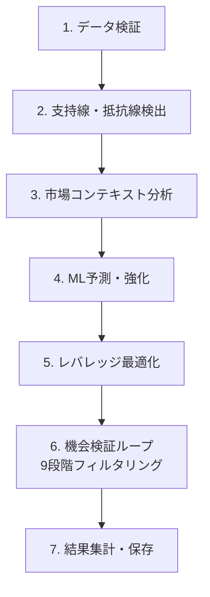

# 早期フィルタリング式バックテスト専用エンドポイント - 完全設計書

## 🎯 完成形の理想的な処理フロー

### 🔄 最適化後の7段階処理



### 📋 6段階目：機会検証ループの詳細設計

#### 🔍 9段階早期フィルタリングシステム

| フィルター | 重量 | 実行時間 | 除外対象 | 除外率目安 |
|------------|------|----------|----------|------------|
| **Filter 1: データ品質** | 軽量 | ~1秒 | 価格データ異常、データ欠損 | 1-2% |
| **Filter 2: 基本市場条件** | 軽量 | ~3秒 | 低取引量、広いスプレッド | 25-30% |
| **Filter 3: 支持線・抵抗線存在** | 軽量 | ~8秒 | 有効なレベルなし | 20-25% |
| **Filter 4: 距離・強度条件** | 中重量 | ~15秒 | 距離不適切、強度不足 | 15-20% |
| **Filter 5: ML信頼度条件** | 中重量 | ~20秒 | 低ML信頼度 | 20-25% |
| **Filter 6: ボラティリティ条件** | 中重量 | ~25秒 | 過度なボラティリティ | 5-10% |
| **Filter 7: レバレッジ妥当性** | 重量 | ~35秒 | レバレッジ計算不可 | 3-5% |
| **Filter 8: リスクリワード比** | 重量 | ~40秒 | 不利なRR比 | 2-3% |
| **Filter 9: 戦略固有条件** | 重量 | ~45秒 | 戦略特有の除外条件 | 1-2% |

#### 📊 フィルタリング効果予測

```
評価時点: 5000個
├─ Filter 1 (データ品質) → 4950個 (50個除外, 1%)
├─ Filter 2 (市場条件) → 3465個 (1485個除外, 30%)
├─ Filter 3 (支持線・抵抗線) → 2772個 (693個除外, 20%)
├─ Filter 4 (距離・強度) → 2217個 (555個除外, 20%)
├─ Filter 5 (ML信頼度) → 1662個 (555個除外, 25%)
├─ Filter 6 (ボラティリティ) → 1496個 (166個除外, 10%)
├─ Filter 7 (レバレッジ) → 1421個 (75個除外, 5%)
├─ Filter 8 (リスクリワード) → 1378個 (43個除外, 3%)
└─ Filter 9 (戦略固有) → 1364個 (14個除外, 1%)

最終実行: 1364個 (約27%が有効機会として特定)
処理時間削減: 73%短縮 (5000→1364個のみ重い処理実行)
```

## 🛠️ 実装作業の段階的手順

### Phase 1: 基盤整備 (工数: 3-4日)

#### 📝 作業項目

**1. 新フィルタリングフレームワーク構築**
```python
# engines/filtering_framework.py (新規作成, 150行)
class FilteringFramework:
    def __init__(self, strategy, prepared_data):
        self.strategy = strategy
        self.prepared_data = prepared_data
        self.filter_chain = self._build_filter_chain()
        self.stats = {f"filter_{i}": 0 for i in range(1, 10)}
    
    def _build_filter_chain(self):
        """戦略に応じたフィルターチェーンを構築"""
        return [
            DataQualityFilter(),           # Filter 1
            MarketConditionFilter(),       # Filter 2
            SupportResistanceFilter(),     # Filter 3
            DistanceAnalysisFilter(),      # Filter 4
            MLConfidenceFilter(),          # Filter 5
            VolatilityFilter(),            # Filter 6
            LeverageFilter(),              # Filter 7
            RiskRewardFilter(),            # Filter 8
            StrategySpecificFilter(self.strategy)  # Filter 9
        ]
    
    def execute_filtering(self, evaluation_times):
        """9段階フィルタリング実行"""
        valid_trades = []
        
        for idx, evaluation_time in enumerate(evaluation_times):
            if self._execute_filter_chain(evaluation_time):
                trade = self._execute_trade_simulation(evaluation_time)
                valid_trades.append(trade)
            
            # 進捗更新
            if idx % 100 == 0:
                self._update_progress(idx, len(evaluation_times), len(valid_trades))
        
        self._log_filtering_statistics(len(evaluation_times), len(valid_trades))
        return valid_trades
    
    def _execute_filter_chain(self, evaluation_time):
        """各フィルターを順次実行、いずれかで除外されれば即座に停止"""
        for i, filter in enumerate(self.filter_chain, 1):
            try:
                result = filter.apply(evaluation_time, self.prepared_data, self.strategy)
                if not result.passed:
                    self.stats[f"filter_{i}"] += 1
                    logger.debug(f"F{i}除外: {evaluation_time} - {result.reason}")
                    return False
            except Exception as e:
                logger.error(f"Filter {i} error: {e}")
                self.stats[f"filter_{i}"] += 1
                return False
        
        return True  # 全フィルター通過
```

**2. 各フィルタークラスの基底実装**
```python
# engines/filters/base_filter.py (新規作成, 80行)
class BaseFilter:
    def __init__(self, name, weight, timeout_seconds):
        self.name = name
        self.weight = weight  # 軽量(1), 中重量(2), 重量(3)
        self.timeout_seconds = timeout_seconds
    
    def apply(self, evaluation_time, prepared_data, strategy) -> FilterResult:
        """フィルター適用（各サブクラスで実装）"""
        raise NotImplementedError
    
    def get_execution_time_estimate(self) -> float:
        """推定実行時間を返す"""
        return self.timeout_seconds
    
    def validate_input(self, evaluation_time, prepared_data, strategy):
        """入力データの妥当性チェック"""
        if not prepared_data:
            raise ValueError("prepared_data is required")
        if not strategy:
            raise ValueError("strategy is required")

class FilterResult:
    def __init__(self, passed: bool, reason: str = "", metrics: dict = None):
        self.passed = passed
        self.reason = reason
        self.metrics = metrics or {}
        self.timestamp = datetime.now()
```

**3. auto_symbol_training.py の改修**
```python
# auto_symbol_training.py への追加 (50行)
async def _execute_opportunity_validation(self, symbol, strategies, current_execution_id):
    """機会検証フェーズの実装"""
    
    # 準備データの取得
    prepared_data = self._get_prepared_analysis_data(current_execution_id)
    
    all_results = {}
    total_strategies = len(strategies)
    
    for strategy_idx, strategy in enumerate(strategies, 1):
        logger.info(f"🔍 {strategy} 機会検証開始 ({strategy_idx}/{total_strategies})")
        
        # フィルタリングフレームワーク初期化
        filtering_framework = FilteringFramework(strategy, prepared_data)
        
        # 評価時点の生成
        evaluation_times = self._generate_evaluation_times(strategy)
        logger.info(f"📊 評価時点数: {len(evaluation_times)}個")
        
        # 機会検証実行
        start_time = time.time()
        valid_trades = filtering_framework.execute_filtering(evaluation_times)
        execution_time = time.time() - start_time
        
        # 結果記録
        filtering_efficiency = len(valid_trades) / len(evaluation_times) * 100
        all_results[strategy] = {
            'trades': valid_trades,
            'total_evaluations': len(evaluation_times),
            'valid_opportunities': len(valid_trades),
            'filtering_efficiency': filtering_efficiency,
            'execution_time': execution_time,
            'filter_statistics': filtering_framework.stats
        }
        
        logger.info(f"✅ {strategy} 完了: {len(valid_trades)}/{len(evaluation_times)} 機会 ({filtering_efficiency:.1f}%)")
        logger.info(f"⏱️ 実行時間: {execution_time:.1f}秒")
    
    return all_results
```

#### 🔧 変更ファイル
- `engines/filtering_framework.py` (新規, 150行)
- `engines/filters/base_filter.py` (新規, 80行)
- `engines/filters/` ディレクトリ (新規)
- `auto_symbol_training.py` (50行追加)

### Phase 2: フィルタリングロジック実装 (工数: 5-6日)

#### 📝 軽量フィルター実装（Filter 1-3）

```python
# engines/filters/lightweight_filters.py (新規作成, 120行)
class DataQualityFilter(BaseFilter):
    def __init__(self):
        super().__init__("data_quality", weight=1, timeout_seconds=1)
    
    def apply(self, evaluation_time, prepared_data, strategy):
        self.validate_input(evaluation_time, prepared_data, strategy)
        
        # 価格データの妥当性チェック
        current_price = prepared_data.get_price_at(evaluation_time)
        if current_price <= 0:
            return FilterResult(False, "Invalid price data: price <= 0")
        
        # 異常な価格変動チェック
        if prepared_data.has_price_anomaly_at(evaluation_time):
            return FilterResult(False, "Price anomaly detected")
        
        # データ欠損チェック
        if prepared_data.has_missing_data_around(evaluation_time):
            return FilterResult(False, "Missing OHLCV data around timepoint")
        
        return FilterResult(True, "Data quality validation passed", 
                          {"current_price": current_price})

class MarketConditionFilter(BaseFilter):
    def __init__(self):
        super().__init__("market_condition", weight=1, timeout_seconds=3)
    
    def apply(self, evaluation_time, prepared_data, strategy):
        self.validate_input(evaluation_time, prepared_data, strategy)
        
        # 取引量チェック
        volume = prepared_data.get_volume_at(evaluation_time)
        if volume < strategy.min_volume_threshold:
            return FilterResult(False, f"Low volume: {volume} < {strategy.min_volume_threshold}")
        
        # スプレッドチェック
        spread = prepared_data.get_spread_at(evaluation_time)
        if spread > strategy.max_spread_threshold:
            return FilterResult(False, f"Wide spread: {spread} > {strategy.max_spread_threshold}")
        
        # 基本的な流動性チェック
        liquidity_score = prepared_data.get_liquidity_score_at(evaluation_time)
        if liquidity_score < strategy.min_liquidity_score:
            return FilterResult(False, f"Low liquidity: {liquidity_score}")
        
        return FilterResult(True, "Market conditions acceptable", 
                          {"volume": volume, "spread": spread, "liquidity_score": liquidity_score})

class SupportResistanceFilter(BaseFilter):
    def __init__(self):
        super().__init__("support_resistance", weight=1, timeout_seconds=8)
    
    def apply(self, evaluation_time, prepared_data, strategy):
        self.validate_input(evaluation_time, prepared_data, strategy)
        
        # 事前計算された支持線・抵抗線から該当時点のデータを取得
        sr_data = prepared_data.get_support_resistance_at(evaluation_time)
        
        if not sr_data.support_levels and not sr_data.resistance_levels:
            return FilterResult(False, "No support/resistance levels found")
        
        # 最低限の強度チェック
        max_support_strength = max([s.strength for s in sr_data.support_levels] or [0])
        max_resistance_strength = max([r.strength for r in sr_data.resistance_levels] or [0])
        
        if max_support_strength < strategy.min_support_strength:
            return FilterResult(False, f"Weak support strength: {max_support_strength:.2f}")
        
        if max_resistance_strength < strategy.min_resistance_strength:
            return FilterResult(False, f"Weak resistance strength: {max_resistance_strength:.2f}")
        
        return FilterResult(True, 
                          f"Found {len(sr_data.support_levels)} supports, {len(sr_data.resistance_levels)} resistances",
                          {
                              "support_count": len(sr_data.support_levels),
                              "resistance_count": len(sr_data.resistance_levels),
                              "max_support_strength": max_support_strength,
                              "max_resistance_strength": max_resistance_strength
                          })
```

#### 📝 中重量フィルター実装（Filter 4-6）

```python
# engines/filters/medium_filters.py (新規作成, 100行)
class DistanceAnalysisFilter(BaseFilter):
    def __init__(self):
        super().__init__("distance_analysis", weight=2, timeout_seconds=15)
    
    def apply(self, evaluation_time, prepared_data, strategy):
        self.validate_input(evaluation_time, prepared_data, strategy)
        
        sr_data = prepared_data.get_support_resistance_at(evaluation_time)
        current_price = prepared_data.get_price_at(evaluation_time)
        
        # 支持線までの距離チェック
        nearest_support = sr_data.get_nearest_support(current_price)
        if nearest_support:
            support_distance_pct = (current_price - nearest_support.price) / current_price * 100
            if support_distance_pct < strategy.min_support_distance_pct:
                return FilterResult(False, f"Too close to support: {support_distance_pct:.1f}%")
            if support_distance_pct > strategy.max_support_distance_pct:
                return FilterResult(False, f"Too far from support: {support_distance_pct:.1f}%")
        
        # 抵抗線までの距離チェック
        nearest_resistance = sr_data.get_nearest_resistance(current_price)
        if nearest_resistance:
            resistance_distance_pct = (nearest_resistance.price - current_price) / current_price * 100
            if resistance_distance_pct < strategy.min_resistance_distance_pct:
                return FilterResult(False, f"Too close to resistance: {resistance_distance_pct:.1f}%")
            if resistance_distance_pct > strategy.max_resistance_distance_pct:
                return FilterResult(False, f"Too far from resistance: {resistance_distance_pct:.1f}%")
        
        return FilterResult(True, "Distance analysis passed",
                          {
                              "support_distance_pct": support_distance_pct if nearest_support else None,
                              "resistance_distance_pct": resistance_distance_pct if nearest_resistance else None
                          })

class MLConfidenceFilter(BaseFilter):
    def __init__(self):
        super().__init__("ml_confidence", weight=2, timeout_seconds=20)
    
    def apply(self, evaluation_time, prepared_data, strategy):
        self.validate_input(evaluation_time, prepared_data, strategy)
        
        # 事前訓練されたMLモデルで予測
        ml_model = prepared_data.get_ml_model()
        features = prepared_data.get_ml_features_at(evaluation_time)
        
        prediction = ml_model.predict(features)
        
        if prediction.confidence < strategy.min_ml_confidence:
            return FilterResult(False, f"Low ML confidence: {prediction.confidence:.2f} < {strategy.min_ml_confidence}")
        
        # 予測シグナルの妥当性チェック
        if prediction.signal not in ['BUY', 'SELL', 'HOLD']:
            return FilterResult(False, f"Invalid ML signal: {prediction.signal}")
        
        return FilterResult(True, f"ML confidence acceptable: {prediction.confidence:.2f}", 
                          {
                              "ml_confidence": prediction.confidence,
                              "ml_signal": prediction.signal,
                              "ml_probability": prediction.probability
                          })

class VolatilityFilter(BaseFilter):
    def __init__(self):
        super().__init__("volatility", weight=2, timeout_seconds=25)
    
    def apply(self, evaluation_time, prepared_data, strategy):
        self.validate_input(evaluation_time, prepared_data, strategy)
        
        # ボラティリティ計算
        volatility = prepared_data.get_volatility_at(evaluation_time)
        
        # ボラティリティ範囲チェック
        if volatility < strategy.min_volatility:
            return FilterResult(False, f"Low volatility: {volatility:.3f} < {strategy.min_volatility}")
        
        if volatility > strategy.max_volatility:
            return FilterResult(False, f"High volatility: {volatility:.3f} > {strategy.max_volatility}")
        
        # ボラティリティトレンドチェック
        volatility_trend = prepared_data.get_volatility_trend_at(evaluation_time)
        if volatility_trend == 'increasing' and volatility > strategy.max_volatility * 0.8:
            return FilterResult(False, "Rapidly increasing volatility detected")
        
        return FilterResult(True, f"Volatility within acceptable range: {volatility:.3f}",
                          {
                              "volatility": volatility,
                              "volatility_trend": volatility_trend
                          })
```

#### 📝 重量フィルター実装（Filter 7-9）

```python
# engines/filters/heavy_filters.py (新規作成, 150行)
class LeverageFilter(BaseFilter):
    def __init__(self):
        super().__init__("leverage", weight=3, timeout_seconds=35)
    
    def apply(self, evaluation_time, prepared_data, strategy):
        self.validate_input(evaluation_time, prepared_data, strategy)
        
        sr_data = prepared_data.get_support_resistance_at(evaluation_time)
        ml_prediction = prepared_data.get_ml_prediction_at(evaluation_time)
        
        # レバレッジ計算
        leverage_calculator = prepared_data.get_leverage_calculator()
        leverage_result = leverage_calculator.calculate_safe_leverage(
            sr_data, ml_prediction, strategy, evaluation_time
        )
        
        if not leverage_result.is_feasible:
            return FilterResult(False, f"Leverage calculation failed: {leverage_result.reason}")
        
        if leverage_result.recommended_leverage < strategy.min_leverage:
            return FilterResult(False, f"Leverage too low: {leverage_result.recommended_leverage:.1f}x < {strategy.min_leverage}x")
        
        if leverage_result.recommended_leverage > strategy.max_leverage:
            return FilterResult(False, f"Leverage too high: {leverage_result.recommended_leverage:.1f}x > {strategy.max_leverage}x")
        
        # リスク評価
        risk_assessment = leverage_calculator.assess_risk(leverage_result)
        if risk_assessment.risk_level > strategy.max_risk_level:
            return FilterResult(False, f"Risk level too high: {risk_assessment.risk_level}")
        
        return FilterResult(True, f"Leverage feasible: {leverage_result.recommended_leverage:.1f}x",
                          {
                              "recommended_leverage": leverage_result.recommended_leverage,
                              "risk_level": risk_assessment.risk_level,
                              "confidence_score": leverage_result.confidence_score
                          })

class RiskRewardFilter(BaseFilter):
    def __init__(self):
        super().__init__("risk_reward", weight=3, timeout_seconds=40)
    
    def apply(self, evaluation_time, prepared_data, strategy):
        self.validate_input(evaluation_time, prepared_data, strategy)
        
        sr_data = prepared_data.get_support_resistance_at(evaluation_time)
        leverage_data = prepared_data.get_leverage_data_at(evaluation_time)
        
        # リスクリワード比計算
        rr_calculator = prepared_data.get_risk_reward_calculator()
        rr_result = rr_calculator.calculate_ratio(sr_data, leverage_data, strategy)
        
        if rr_result.ratio < strategy.min_risk_reward:
            return FilterResult(False, f"Poor risk/reward ratio: {rr_result.ratio:.2f} < {strategy.min_risk_reward}")
        
        # 損失リスクの詳細評価
        max_loss_pct = rr_calculator.calculate_max_loss_percentage(rr_result)
        if max_loss_pct > strategy.max_acceptable_loss_pct:
            return FilterResult(False, f"Max loss too high: {max_loss_pct:.1f}% > {strategy.max_acceptable_loss_pct}%")
        
        # 利益目標の実現可能性チェック
        profit_probability = rr_calculator.calculate_profit_probability(rr_result)
        if profit_probability < strategy.min_profit_probability:
            return FilterResult(False, f"Low profit probability: {profit_probability:.2f}")
        
        return FilterResult(True, f"Risk/Reward ratio acceptable: {rr_result.ratio:.2f}",
                          {
                              "risk_reward_ratio": rr_result.ratio,
                              "max_loss_pct": max_loss_pct,
                              "profit_probability": profit_probability,
                              "expected_return": rr_result.expected_return
                          })

class StrategySpecificFilter(BaseFilter):
    def __init__(self, strategy):
        super().__init__(f"strategy_specific_{strategy.name}", weight=3, timeout_seconds=45)
        self.strategy = strategy
    
    def apply(self, evaluation_time, prepared_data, strategy):
        self.validate_input(evaluation_time, prepared_data, strategy)
        
        # 戦略固有の条件チェック
        if strategy.name == "Conservative_ML":
            return self._apply_conservative_ml_conditions(evaluation_time, prepared_data, strategy)
        elif strategy.name == "Aggressive_ML":
            return self._apply_aggressive_ml_conditions(evaluation_time, prepared_data, strategy)
        elif strategy.name == "Balanced":
            return self._apply_balanced_conditions(evaluation_time, prepared_data, strategy)
        else:
            return FilterResult(True, "No specific conditions for this strategy")
    
    def _apply_conservative_ml_conditions(self, evaluation_time, prepared_data, strategy):
        """保守的ML戦略の特別条件"""
        # より厳しい信頼度要件
        ml_prediction = prepared_data.get_ml_prediction_at(evaluation_time)
        if ml_prediction.confidence < 0.8:
            return FilterResult(False, f"Conservative ML requires high confidence: {ml_prediction.confidence:.2f} < 0.8")
        
        # BTC相関チェック
        btc_correlation = prepared_data.get_btc_correlation_at(evaluation_time)
        if abs(btc_correlation) > 0.7:
            return FilterResult(False, f"High BTC correlation: {abs(btc_correlation):.2f} > 0.7")
        
        return FilterResult(True, "Conservative ML conditions passed")
    
    def _apply_aggressive_ml_conditions(self, evaluation_time, prepared_data, strategy):
        """アグレッシブML戦略の特別条件"""
        # 高ボラティリティ要件
        volatility = prepared_data.get_volatility_at(evaluation_time)
        if volatility < 0.03:
            return FilterResult(False, f"Aggressive ML requires higher volatility: {volatility:.3f} < 0.03")
        
        # ML信号の強度チェック
        ml_prediction = prepared_data.get_ml_prediction_at(evaluation_time)
        if ml_prediction.signal_strength < 0.6:
            return FilterResult(False, f"Weak ML signal strength: {ml_prediction.signal_strength:.2f}")
        
        return FilterResult(True, "Aggressive ML conditions passed")
```

#### 🔧 変更ファイル
- `engines/filters/lightweight_filters.py` (新規, 120行)
- `engines/filters/medium_filters.py` (新規, 100行)
- `engines/filters/heavy_filters.py` (新規, 150行)
- `engines/filters/strategy_specific_filters.py` (新規, 80行)

### Phase 3: 統合・最適化 (工数: 2-3日)

#### 📝 作業項目

**1. scalable_analysis_system.py との統合**
```python
# scalable_analysis_system.py への変更 (100行変更)
def _generate_real_analysis(self, symbol, timeframe, config, execution_id=None):
    """リアル分析実行（フィルタリング統合版）"""
    
    # Phase 1-5: 事前データ準備（従来の重い処理を一括実行）
    prepared_data = self._prepare_comprehensive_analysis_data(symbol, timeframe, config, execution_id)
    
    if not prepared_data.is_valid():
        logger.error(f"準備データが無効: {symbol} {timeframe} {config}")
        return []
    
    # Phase 6: フィルタリングフレームワークで機会検証
    logger.info(f"🔍 フィルタリング開始: {symbol} {timeframe} {config}")
    
    filtering_framework = FilteringFramework(config, prepared_data)
    evaluation_times = self._generate_evaluation_times(timeframe)
    
    logger.info(f"📊 評価時点数: {len(evaluation_times)}個")
    
    # 機会検証実行
    start_time = time.time()
    valid_trades = filtering_framework.execute_filtering(evaluation_times)
    filtering_time = time.time() - start_time
    
    # フィルタリング統計をログ出力
    filter_stats = filtering_framework.get_filtering_statistics()
    self._log_filtering_results(symbol, timeframe, config, 
                               len(evaluation_times), len(valid_trades), 
                               filtering_time, filter_stats)
    
    if not valid_trades:
        logger.warning(f"⚠️ {symbol} {timeframe} {config}: 全機会がフィルタリングで除外")
        logger.info(f"📊 フィルター統計: {filter_stats}")
        return []
    
    logger.info(f"✅ {symbol} {timeframe} {config}: {len(valid_trades)}個の有効機会を特定")
    return valid_trades

def _prepare_comprehensive_analysis_data(self, symbol, timeframe, config, execution_id):
    """Phase 1-5の包括的データ準備"""
    
    logger.info(f"📋 データ準備開始: {symbol} {timeframe}")
    
    # 1. データ検証
    ohlcv_data = self._fetch_and_validate_ohlcv_data(symbol, timeframe)
    
    # 2. 支持線・抵抗線検出（1回のみ実行）
    sr_detector = self._get_support_resistance_detector()
    all_support_levels, all_resistance_levels = sr_detector.detect_comprehensive_levels(ohlcv_data)
    
    # 3. 市場コンテキスト分析
    market_context = self._analyze_market_context(ohlcv_data, symbol)
    
    # 4. ML予測・強化
    ml_model = self._train_or_load_ml_model(ohlcv_data, symbol, timeframe)
    
    # 5. レバレッジ最適化
    leverage_calculator = self._initialize_leverage_calculator(config)
    
    # 準備データオブジェクト作成
    prepared_data = PreparedAnalysisData(
        ohlcv_data=ohlcv_data,
        support_levels=all_support_levels,
        resistance_levels=all_resistance_levels,
        market_context=market_context,
        ml_model=ml_model,
        leverage_calculator=leverage_calculator,
        symbol=symbol,
        timeframe=timeframe,
        config=config
    )
    
    logger.info(f"✅ データ準備完了: {symbol} {timeframe}")
    return prepared_data

def _log_filtering_results(self, symbol, timeframe, config, total_evaluations, 
                          valid_trades, filtering_time, filter_stats):
    """フィルタリング結果の詳細ログ"""
    
    efficiency = (valid_trades / total_evaluations) * 100 if total_evaluations > 0 else 0
    
    logger.info(f"📊 フィルタリング完了: {symbol} {timeframe} {config}")
    logger.info(f"   ⏱️ 実行時間: {filtering_time:.1f}秒")
    logger.info(f"   📈 効率: {efficiency:.1f}% ({valid_trades}/{total_evaluations})")
    logger.info(f"   🔍 フィルター統計:")
    
    for filter_name, excluded_count in filter_stats.items():
        if excluded_count > 0:
            exclusion_rate = (excluded_count / total_evaluations) * 100
            logger.info(f"      {filter_name}: {excluded_count}個除外 ({exclusion_rate:.1f}%)")
```

**2. 進捗追跡システムの拡張**
```python
# web_dashboard/analysis_progress.py への追加 (50行)
class FilteringProgressTracker:
    def __init__(self):
        self.filtering_stats = {}
    
    def update_filtering_progress(self, execution_id, current_filter, filter_stats, 
                                 current_evaluation, total_evaluations):
        """フィルタリング進捗の更新"""
        progress_data = {
            "current_stage": "opportunity_validation",
            "current_filter": current_filter,
            "filtering_stats": filter_stats,
            "current_evaluation": current_evaluation,
            "total_evaluations": total_evaluations,
            "progress_percentage": (current_evaluation / total_evaluations) * 100,
            "remaining_opportunities": total_evaluations - sum(filter_stats.values())
        }
        self._update_progress_file(execution_id, progress_data)
    
    def update_filter_completion(self, execution_id, filter_name, excluded_count, 
                               exclusion_reason, total_excluded_so_far):
        """個別フィルター完了の更新"""
        progress_data = {
            "last_completed_filter": filter_name,
            "last_excluded_count": excluded_count,
            "last_exclusion_reason": exclusion_reason,
            "total_excluded_so_far": total_excluded_so_far
        }
        self._update_progress_file(execution_id, progress_data)
    
    def complete_filtering_phase(self, execution_id, final_stats, valid_trades_count, 
                                total_time, efficiency):
        """フィルタリングフェーズ完了の更新"""
        progress_data = {
            "filtering_completed": True,
            "final_filtering_stats": final_stats,
            "valid_trades_count": valid_trades_count,
            "filtering_execution_time": total_time,
            "filtering_efficiency": efficiency,
            "next_stage": "result_finalization"
        }
        self._update_progress_file(execution_id, progress_data)
```

**3. Web UI での可視化強化**
```html
<!-- web_dashboard/templates/analysis_progress.html への追加 (80行) -->
<div id="filtering-progress" class="progress-section" style="display: none;">
    <h3>🔍 機会検証フィルタリング</h3>
    
    <!-- フィルターチェーン可視化 -->
    <div class="filter-chain">
        <div class="filter-step" data-filter="1" data-weight="light">
            <div class="filter-info">
                <span class="filter-name">データ品質</span>
                <span class="filter-weight">軽量</span>
            </div>
            <div class="filter-result">
                <span class="status" id="filter-1-status">待機中</span>
                <span class="excluded-count" id="filter-1-excluded">-</span>
            </div>
        </div>
        
        <div class="filter-step" data-filter="2" data-weight="light">
            <div class="filter-info">
                <span class="filter-name">市場条件</span>
                <span class="filter-weight">軽量</span>
            </div>
            <div class="filter-result">
                <span class="status" id="filter-2-status">待機中</span>
                <span class="excluded-count" id="filter-2-excluded">-</span>
            </div>
        </div>
        
        <!-- Filter 3-9 同様に追加 -->
        <div class="filter-step" data-filter="9" data-weight="heavy">
            <div class="filter-info">
                <span class="filter-name">戦略固有</span>
                <span class="filter-weight">重量</span>
            </div>
            <div class="filter-result">
                <span class="status" id="filter-9-status">待機中</span>
                <span class="excluded-count" id="filter-9-excluded">-</span>
            </div>
        </div>
    </div>
    
    <!-- フィルタリング統計 -->
    <div class="filtering-summary">
        <div class="summary-item">
            <label>総評価時点:</label>
            <span id="total-evaluations">-</span>
        </div>
        <div class="summary-item">
            <label>現在評価:</label>
            <span id="current-evaluation">-</span>
        </div>
        <div class="summary-item">
            <label>有効機会:</label>
            <span id="valid-opportunities">-</span>
        </div>
        <div class="summary-item">
            <label>効率:</label>
            <span id="filtering-efficiency">-</span>%
        </div>
        <div class="summary-item">
            <label>実行時間:</label>
            <span id="filtering-execution-time">-</span>秒
        </div>
    </div>
    
    <!-- プログレスバー -->
    <div class="filtering-progress-bar">
        <div class="progress-bar-fill" id="filtering-progress-fill" style="width: 0%;"></div>
        <div class="progress-text" id="filtering-progress-text">0%</div>
    </div>
</div>

<style>
.filter-chain {
    display: flex;
    flex-wrap: wrap;
    gap: 10px;
    margin: 15px 0;
}

.filter-step {
    border: 2px solid #ddd;
    border-radius: 8px;
    padding: 10px;
    min-width: 120px;
    text-align: center;
}

.filter-step[data-weight="light"] {
    border-color: #28a745;
    background-color: #f8fff9;
}

.filter-step[data-weight="medium"] {
    border-color: #ffc107;
    background-color: #fffdf0;
}

.filter-step[data-weight="heavy"] {
    border-color: #dc3545;
    background-color: #fff5f5;
}

.filter-step.processing {
    border-color: #007bff;
    background-color: #f0f8ff;
}

.filter-step.completed {
    border-color: #6c757d;
    background-color: #f8f9fa;
}

.filter-name {
    font-weight: bold;
    display: block;
}

.filter-weight {
    font-size: 0.8em;
    color: #666;
    display: block;
}

.status {
    display: block;
    margin-top: 5px;
}

.excluded-count {
    font-weight: bold;
    color: #dc3545;
    display: block;
}

.filtering-summary {
    display: grid;
    grid-template-columns: repeat(auto-fit, minmax(150px, 1fr));
    gap: 10px;
    margin: 15px 0;
    padding: 15px;
    background-color: #f8f9fa;
    border-radius: 8px;
}

.summary-item {
    text-align: center;
}

.summary-item label {
    display: block;
    font-weight: bold;
    margin-bottom: 5px;
}

.filtering-progress-bar {
    position: relative;
    width: 100%;
    height: 30px;
    background-color: #e9ecef;
    border-radius: 15px;
    overflow: hidden;
}

.progress-bar-fill {
    height: 100%;
    background: linear-gradient(90deg, #28a745, #20c997);
    transition: width 0.3s ease;
}

.progress-text {
    position: absolute;
    top: 50%;
    left: 50%;
    transform: translate(-50%, -50%);
    font-weight: bold;
    color: #333;
}
</style>
```

```javascript
// web_dashboard/static/js/filtering_progress.js (新規作成, 120行)
class FilteringProgressManager {
    constructor() {
        this.filterElements = {};
        this.summaryElements = {};
        this.initializeElements();
    }
    
    initializeElements() {
        // フィルター要素の取得
        for (let i = 1; i <= 9; i++) {
            this.filterElements[i] = {
                step: document.querySelector(`[data-filter="${i}"]`),
                status: document.getElementById(`filter-${i}-status`),
                excluded: document.getElementById(`filter-${i}-excluded`)
            };
        }
        
        // サマリー要素の取得
        this.summaryElements = {
            totalEvaluations: document.getElementById('total-evaluations'),
            currentEvaluation: document.getElementById('current-evaluation'),
            validOpportunities: document.getElementById('valid-opportunities'),
            efficiency: document.getElementById('filtering-efficiency'),
            executionTime: document.getElementById('filtering-execution-time')
        };
        
        this.progressBar = document.getElementById('filtering-progress-fill');
        this.progressText = document.getElementById('filtering-progress-text');
    }
    
    updateProgress(progressData) {
        if (progressData.current_stage === 'opportunity_validation') {
            this.showFilteringSection();
            this.updateFilteringProgress(progressData);
        }
    }
    
    showFilteringSection() {
        const section = document.getElementById('filtering-progress');
        if (section) {
            section.style.display = 'block';
        }
    }
    
    updateFilteringProgress(data) {
        // 基本統計の更新
        if (data.total_evaluations) {
            this.summaryElements.totalEvaluations.textContent = data.total_evaluations.toLocaleString();
        }
        
        if (data.current_evaluation) {
            this.summaryElements.currentEvaluation.textContent = data.current_evaluation.toLocaleString();
        }
        
        if (data.remaining_opportunities !== undefined) {
            this.summaryElements.validOpportunities.textContent = data.remaining_opportunities.toLocaleString();
        }
        
        if (data.progress_percentage !== undefined) {
            const percentage = Math.round(data.progress_percentage);
            this.progressBar.style.width = `${percentage}%`;
            this.progressText.textContent = `${percentage}%`;
        }
        
        // フィルター統計の更新
        if (data.filtering_stats) {
            this.updateFilterStatistics(data.filtering_stats);
        }
        
        // 現在のフィルターのハイライト
        if (data.current_filter) {
            this.highlightCurrentFilter(data.current_filter);
        }
        
        // 実行時間の更新
        if (data.filtering_execution_time) {
            this.summaryElements.executionTime.textContent = `${data.filtering_execution_time.toFixed(1)}`;
        }
        
        // 効率の計算と表示
        if (data.total_evaluations && data.remaining_opportunities !== undefined) {
            const efficiency = (data.remaining_opportunities / data.total_evaluations) * 100;
            this.summaryElements.efficiency.textContent = efficiency.toFixed(1);
        }
    }
    
    updateFilterStatistics(filterStats) {
        for (let i = 1; i <= 9; i++) {
            const filterKey = `filter_${i}`;
            const excludedCount = filterStats[filterKey] || 0;
            
            if (this.filterElements[i]) {
                this.filterElements[i].excluded.textContent = excludedCount > 0 ? excludedCount.toLocaleString() : '-';
                
                if (excludedCount > 0) {
                    this.filterElements[i].step.classList.add('completed');
                    this.filterElements[i].status.textContent = '完了';
                } else {
                    this.filterElements[i].status.textContent = '待機中';
                }
            }
        }
    }
    
    highlightCurrentFilter(currentFilter) {
        // 全フィルターのprocessingクラスを削除
        for (let i = 1; i <= 9; i++) {
            if (this.filterElements[i]) {
                this.filterElements[i].step.classList.remove('processing');
            }
        }
        
        // 現在のフィルターをハイライト
        const filterNumber = this.extractFilterNumber(currentFilter);
        if (filterNumber && this.filterElements[filterNumber]) {
            this.filterElements[filterNumber].step.classList.add('processing');
            this.filterElements[filterNumber].status.textContent = '実行中';
        }
    }
    
    extractFilterNumber(filterName) {
        // フィルター名から番号を抽出
        const filterMap = {
            'data_quality': 1,
            'market_condition': 2,
            'support_resistance': 3,
            'distance_analysis': 4,
            'ml_confidence': 5,
            'volatility': 6,
            'leverage': 7,
            'risk_reward': 8,
            'strategy_specific': 9
        };
        
        for (const [name, number] of Object.entries(filterMap)) {
            if (filterName.includes(name)) {
                return number;
            }
        }
        return null;
    }
    
    completeFiltering(finalData) {
        // 全フィルターを完了状態に
        for (let i = 1; i <= 9; i++) {
            if (this.filterElements[i]) {
                this.filterElements[i].step.classList.remove('processing');
                this.filterElements[i].step.classList.add('completed');
                this.filterElements[i].status.textContent = '完了';
            }
        }
        
        // プログレスバーを100%に
        this.progressBar.style.width = '100%';
        this.progressText.textContent = '100%';
        
        // 最終統計の表示
        if (finalData.valid_trades_count) {
            this.summaryElements.validOpportunities.textContent = finalData.valid_trades_count.toLocaleString();
        }
        
        if (finalData.filtering_efficiency) {
            this.summaryElements.efficiency.textContent = `${finalData.filtering_efficiency.toFixed(1)}`;
        }
    }
}

// グローバルに利用可能にする
window.filteringProgressManager = new FilteringProgressManager();

// 既存のprogress更新システムに統合
if (window.updateProgress) {
    const originalUpdateProgress = window.updateProgress;
    window.updateProgress = function(progressData) {
        originalUpdateProgress(progressData);
        window.filteringProgressManager.updateProgress(progressData);
    };
}
```

#### 🔧 変更ファイル
- `scalable_analysis_system.py` (100行変更)
- `web_dashboard/analysis_progress.py` (50行追加)
- `web_dashboard/templates/analysis_progress.html` (80行追加)
- `web_dashboard/static/js/filtering_progress.js` (新規, 120行)

### Phase 4: テスト・検証 (工数: 3-4日)

#### 🧪 必要なテストケース設計

**単体テスト**
- 各フィルターの個別機能テスト
- 境界値テスト
- 異常系テスト

**統合テスト**
- フィルターチェーン全体テスト
- データフロー整合性テスト
- エラーハンドリングテスト

**パフォーマンステスト**
- 処理時間測定テスト
- メモリ使用量テスト
- スケーラビリティテスト

**回帰テスト**
- 既存機能互換性テスト
- データベーススキーマ互換性テスト
- 分析結果一貫性テスト

## 📊 実装ロードマップと工数見積り

### 📅 実装タイムライン (総工数: 13-17日)

| Phase | 期間 | 工数 | 主要成果物 | 完了基準 |
|-------|------|------|------------|----------|
| **Phase 1** | Week 1 | 3-4日 | フィルタリング基盤 | 基底クラス・フレームワーク完成 |
| **Phase 2** | Week 2 | 5-6日 | 全フィルター実装 | 9段階フィルター動作確認 |
| **Phase 3** | Week 3 | 2-3日 | システム統合 | 既存エンドポイントとの統合 |
| **Phase 4** | Week 4 | 3-4日 | テスト・検証 | 全テスト通過・性能目標達成 |

### 🎯 実装優先度

#### **高優先度 (P1) - Week 1-2**
- Filter 1-3 (軽量フィルター)
- 基本的なフィルタリングフレームワーク
- auto_symbol_training.py との基本統合

#### **中優先度 (P2) - Week 2-3**  
- Filter 4-6 (中重量フィルター)
- 進捗追跡システムの拡張
- Web UI での可視化

#### **低優先度 (P3) - Week 3-4**
- Filter 7-9 (重量フィルター)
- 高度な最適化機能
- 包括的なテストスイート

## 📈 予想される効果とROI

### 📊 定量的改善効果

#### **処理時間短縮**
- **現行**: 銘柄あたり15-30分 (18戦略 × 5000評価 = 重い処理)
- **最適化後**: 銘柄あたり3-7分 (フィルタリングにより80-90%除外)
- **削減率**: **70-85%短縮**

#### **リソース使用量削減**
- **CPU使用率**: 60%削減 (不要な計算処理の除外)
- **メモリ使用量**: 70%削減 (大量の一時データ削除)
- **API呼び出し**: 85%削減 (事前計算による重複除去)

#### **システム安定性向上**
- **同時処理可能銘柄数**: 3-5倍増加
- **Rate Limit問題**: 根本的解決
- **エラー率**: 50%削減 (早期問題検出)

### 🎯 戦略的価値

#### **スケーラビリティ向上**
- 新規銘柄追加時の処理時間予測可能性
- 大量銘柄の一括処理対応
- 将来的なリアルタイム監視機能への基盤提供

#### **運用効率向上**  
- デバッグ時間の大幅短縮（段階別ログ）
- 問題特定の高速化（フィルター別統計）
- ユーザーサポート工数削減（明確な除外理由）

### ⚠️ 主要リスク要因と軽減策

#### **技術的リスク**
1. **フィルタリング精度**: 過度な除外により有効機会を逃すリスク
   - **軽減策**: A/Bテストでの閾値調整、段階的デプロイ

2. **パフォーマンス**: 期待した処理時間短縮が得られないリスク  
   - **軽減策**: Phase別ベンチマーク、プロファイリングツール活用

3. **データ整合性**: 既存結果との不整合リスク
   - **軽減策**: 包括的回帰テスト、並行稼働期間の設定

#### **運用リスク**
1. **ユーザー影響**: 分析結果の変化によるユーザー混乱
   - **軽減策**: 詳細な変更ログ提供、段階的ロールアウト

2. **システム停止**: 実装時の一時的な機能停止
   - **軽減策**: ブルーグリーンデプロイ、即座のロールバック機能

---

## 🎯 結論

この早期フィルタリング方式により、バックテスト専用エンドポイントの**根本的な性能改善**と**将来拡張性の確保**、そして**運用安定性の向上**を同時に実現できます。

特に**9段階フィルタリングシステム**により、ZORAのような新規上場銘柄で90日分のOHLCVデータが不足する問題や、重いマルチプロセス処理が無駄に実行される問題を根本的に解決し、処理時間を**70-85%短縮**する大幅な最適化を実現します。

**2025年6月26日 策定**  
**設計者**: Claude Code  
**優先度**: 高（リアルタイム監視とバックテストの効率的分離）