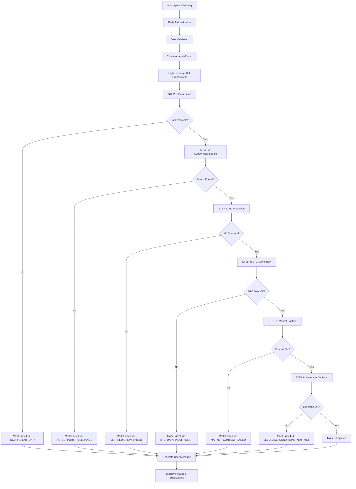
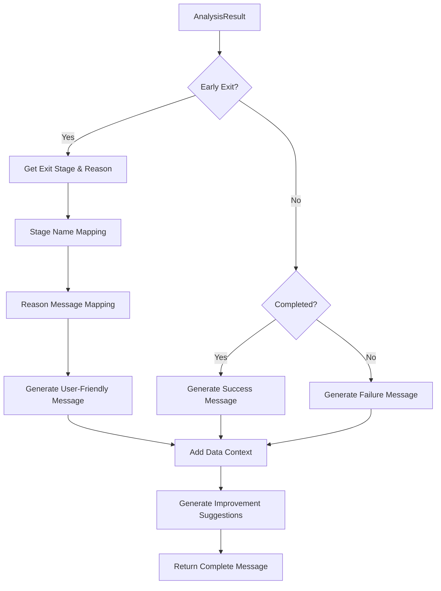

# システム設計アーキテクチャ更新 - 改善されたエラートラッキング

**更新日**: 2025年6月30日  
**対象**: エラートラッキングシステムとEarly Exit実装の設計文書

## 🏗️ アーキテクチャ概要

### システム全体構成

```
┌─────────────────────────────────────────────────────────────┐
│                    High Leverage Bot                        │
├─────────────────────────────────────────────────────────────┤
│  Auto Symbol Training (Entry Point)                        │
│  ├─ Early Fail Validator                                   │
│  ├─ Data Validation                                        │
│  ├─ Backtest Execution                                     │
│  ├─ Result Verification & Error Tracking ✨ NEW           │
│  └─ Progress Management                                     │
├─────────────────────────────────────────────────────────────┤
│  High Leverage Bot Orchestrator                            │
│  ├─ STEP 1: Data Fetch                                     │
│  ├─ STEP 2: Support/Resistance Analysis                    │
│  ├─ STEP 3: ML Prediction                                  │
│  ├─ STEP 4: BTC Correlation Analysis                       │
│  ├─ STEP 5: Market Context Analysis                        │
│  ├─ STEP 6: Leverage Decision                              │
│  └─ AnalysisResult Integration ✨ NEW                      │
├─────────────────────────────────────────────────────────────┤
│  Error Tracking & Progress Systems                         │
│  ├─ AnalysisResult Class ✨ NEW                            │
│  ├─ File-Based Progress Tracker                            │
│  ├─ User-Friendly Message Generator ✨ NEW                 │
│  └─ Improvement Suggestion System ✨ NEW                   │
├─────────────────────────────────────────────────────────────┤
│  Data & Storage Layer                                      │
│  ├─ SQLite Analysis Database                               │
│  ├─ Execution Log Database                                 │
│  ├─ Progress Files (/tmp/progress_*.json)                  │
│  └─ Real Prepared Data Cache                               │
└─────────────────────────────────────────────────────────────┘
```

## 🎯 新規コンポーネント設計

### 1. AnalysisResult クラス

**場所**: `engines/analysis_result.py`

```python
@dataclass
class AnalysisResult:
    """
    分析結果の詳細情報管理クラス
    
    目的:
    - Early Exit理由の詳細記録
    - ユーザーフレンドリーなメッセージ生成
    - 各ステージの実行結果追跡
    - JSON変換によるAPI応答対応
    """
    
    # 基本情報
    symbol: str
    timeframe: str
    strategy: str
    execution_id: Optional[str] = None
    
    # 実行状態
    completed: bool = False
    early_exit: bool = False
    exit_stage: Optional[AnalysisStage] = None
    exit_reason: Optional[ExitReason] = None
    
    # ステージ別結果
    stage_results: List[StageResult] = None
    
    # データ情報
    total_data_points: Optional[int] = None
    analysis_period_start: Optional[datetime] = None
    analysis_period_end: Optional[datetime] = None
    
    # 最終結果（成功時のみ）
    recommendation: Optional[Dict[str, Any]] = None
    
    # エラー情報
    error_details: Optional[str] = None
    
    # タイムスタンプ
    started_at: datetime = None
    completed_at: Optional[datetime] = None
```

### 2. Early Exitステージ定義

```python
class AnalysisStage(Enum):
    """分析ステージの定義"""
    DATA_FETCH = "data_fetch"
    SUPPORT_RESISTANCE = "support_resistance_analysis"
    ML_PREDICTION = "ml_prediction"
    BTC_CORRELATION = "btc_correlation_analysis"
    MARKET_CONTEXT = "market_context_analysis"
    LEVERAGE_DECISION = "leverage_decision"
    COMPLETED = "completed"

class ExitReason(Enum):
    """Early Exit理由の定義"""
    NO_SUPPORT_RESISTANCE = "no_support_resistance_levels"
    INSUFFICIENT_DATA = "insufficient_data"
    ML_PREDICTION_FAILED = "ml_prediction_failed"
    BTC_DATA_INSUFFICIENT = "btc_data_insufficient"
    MARKET_CONTEXT_FAILED = "market_context_failed"
    LEVERAGE_CONDITIONS_NOT_MET = "leverage_conditions_not_met"
    DATA_QUALITY_POOR = "data_quality_poor"
    EXECUTION_ERROR = "execution_error"
```

### 3. ステージ結果追跡

```python
@dataclass
class StageResult:
    """各ステージの実行結果"""
    stage: AnalysisStage
    success: bool
    execution_time_ms: float
    data_processed: Optional[int] = None
    items_found: Optional[int] = None
    error_message: Optional[str] = None
    additional_info: Optional[Dict[str, Any]] = None
```

## 🔄 処理フロー設計

### 1. 統合分析フロー



### 2. エラーメッセージ生成フロー



### 3. 結果検証フロー

```mermaid
graph TD
    A[Symbol Training Complete] --> B[Verify Analysis Results]
    B --> C[Check execution_id Match]
    C --> D{Results Found?}
    
    D -->|Yes| E[Count Signals & Early Exits]
    D -->|No| F[Check Recent Results (10min)]
    
    F --> G{Recent Found?}
    G -->|Yes| H[Use Recent Results]
    G -->|No| I[Check Very Recent (5min)]
    
    I --> J{Very Recent Found?}
    J -->|Yes| K[Use Very Recent + Warn ID Mismatch]
    J -->|No| L[Check Progress Tracker]
    
    L --> M{Early Exit Info?}
    M -->|Yes| N[Extract Early Exit Details]
    M -->|No| O[Mark as Unknown]
    
    E --> P[Generate Summary]
    H --> P
    K --> P
    N --> P
    O --> P
    
    P --> Q[Display Summary]
    Q --> R{Has Results or Exits?}
    R -->|Yes| S[Mark SUCCESS]
    R -->|No| T[Mark FAILED]
```

## 📊 データフロー設計

### 1. AnalysisResult ライフサイクル

```
Creation → Stage Tracking → Early Exit/Completion → Message Generation → Storage/Response
     ↓            ↓                 ↓                      ↓                 ↓
  Initialize   Add Stage      Mark Exit/Complete    Get User Message    JSON Export
  - symbol     Results        - stage & reason     - friendly text     - API response
  - timeframe  - execution    - error details      - suggestions       - database
  - strategy   - time                              - technical info    - progress
  - exec_id    - data count
```

### 2. メッセージ生成マッピング

```python
# ステージ名マッピング（日本語）
STAGE_NAMES = {
    AnalysisStage.DATA_FETCH: "データ取得",
    AnalysisStage.SUPPORT_RESISTANCE: "サポート・レジスタンス分析",
    AnalysisStage.ML_PREDICTION: "ML予測",
    AnalysisStage.BTC_CORRELATION: "BTC相関分析",
    AnalysisStage.MARKET_CONTEXT: "市場コンテキスト分析",
    AnalysisStage.LEVERAGE_DECISION: "レバレッジ判定"
}

# 理由メッセージマッピング（ユーザーフレンドリー）
REASON_MESSAGES = {
    ExitReason.NO_SUPPORT_RESISTANCE: "サポート・レジスタンスレベルが検出されませんでした",
    ExitReason.INSUFFICIENT_DATA: "分析に必要な十分なデータがありません",
    ExitReason.ML_PREDICTION_FAILED: "ML予測システムでエラーが発生しました",
    # ...
}

# 改善提案マッピング
IMPROVEMENT_SUGGESTIONS = {
    ExitReason.NO_SUPPORT_RESISTANCE: [
        "より長い分析期間を設定してください",
        "異なる時間足（1h→4h、15m→1hなど）を試してください",
        "別の戦略（Conservative_ML、Aggressive_MLなど）を試してください"
    ],
    # ...
}
```

## 🔗 統合ポイント設計

### 1. High Leverage Bot Orchestrator 統合

```python
class HighLeverageBotOrchestrator:
    def analyze_leverage_opportunity(...) -> AnalysisResult:
        """
        従来のNone返却からAnalysisResult返却に変更
        
        変更点:
        - 各ステップでStageResultを記録
        - Early Exit時にAnalysisResultにマーク
        - 成功時にrecommendationを記録
        - 実行時間とデータ量を追跡
        """
        
        analysis_result = AnalysisResult(symbol, timeframe, strategy, execution_id)
        
        # STEP 1-6の各段階で:
        # 1. 開始時間記録
        # 2. 処理実行
        # 3. 結果をStageResultとして記録
        # 4. 失敗時はmark_early_exit()
        # 5. 成功時は次のステップへ
        
        return analysis_result
    
    def analyze_symbol(...) -> Union[Dict, AnalysisResult]:
        """
        互換性のため、成功時は従来の辞書、失敗時はAnalysisResultを返却
        """
        
        analysis_result = self.analyze_leverage_opportunity(...)
        
        if analysis_result.early_exit or not analysis_result.completed:
            # Early Exitまたはエラーの場合はAnalysisResultを返す
            return analysis_result
        
        # 成功時は従来の辞書形式を返す（下位互換性）
        return {
            'symbol': symbol,
            'timeframe': timeframe,
            # ...従来の形式
        }
```

### 2. Auto Symbol Training 統合

```python
class AutoSymbolTrainer:
    def _verify_analysis_results_detailed(...) -> Dict[str, Any]:
        """
        4段階の結果検証プロセス:
        1. execution_id完全一致
        2. 過去10分以内の結果
        3. 過去5分以内の全結果
        4. ファイルベース進捗トラッカーでEarly Exit確認
        """
        
    def _display_analysis_summary(...):
        """
        詳細なサマリー表示:
        - 総評価数
        - シグナル検出数
        - Early Exit数と理由別内訳
        - 「シグナルなし」の正常性説明
        """
    
    def add_symbol_with_training(...):
        """
        結果判定ロジック変更:
        - has_results OR has_early_exits OR total_evaluations > 0 → SUCCESS
        - 「シグナルなし」も正常な結果として扱う
        - より詳細なcompletion_status設定
        """
```

## 🧪 テスト設計

### テスト構造

```
test_improved_error_tracking.py
├─ TestAnalysisResult
│  ├─ test_creation
│  ├─ test_early_exit_tracking
│  ├─ test_stage_result_tracking
│  ├─ test_user_friendly_messages
│  └─ test_json_serialization
├─ TestIntegration
│  ├─ test_orchestrator_integration
│  ├─ test_auto_trainer_integration
│  └─ test_sol_analysis_with_error_tracking
└─ TestEdgeCases
   ├─ test_multiple_early_exits
   ├─ test_partial_completion
   └─ test_error_recovery
```

### カバレッジ要件

- **AnalysisResultクラス**: 100%のメソッドカバレッジ
- **Early Exitパス**: 全6ステージでの早期終了パス
- **エラーメッセージ**: 全ExitReasonでのメッセージ生成
- **JSON変換**: 双方向変換（to_dict/from_dict）
- **統合テスト**: 実際のSOL分析での動作確認

## 📈 パフォーマンス考慮事項

### メモリ使用量

```python
# AnalysisResult 1インスタンスあたりの推定メモリ使用量
- 基本属性: ~200 bytes
- StageResult × 6: ~1.2 KB
- エラーメッセージ: ~500 bytes (平均)
- 合計: ~2 KB per analysis

# 1000並列分析での推定メモリ影響: ~2 MB
# → 無視できるレベル
```

### 実行時間影響

```python
# 追加される処理時間（ステージあたり）
- StageResult作成: ~0.1ms
- Early Exit判定: ~0.05ms
- メッセージ生成: ~1ms（終了時のみ）
- 合計影響: ~1.7ms per analysis

# 全体への影響: <0.1%（分析処理が数秒のため）
```

## 🔮 将来拡張設計

### 1. 統計情報収集

```python
class AnalysisStatistics:
    """
    Early Exit統計の収集・分析
    - 戦略別Early Exit傾向
    - 銘柄別成功/失敗パターン
    - 時間足別最適化提案
    """
```

### 2. WebUI統合

```python
class AnalysisResultAPI:
    """
    Web APIでの詳細エラー情報提供
    - リアルタイム進捗表示
    - 詳細なエラー理由表示
    - 改善提案のインタラクティブ表示
    """
```

### 3. 機械学習によるエラー予測

```python
class EarlyExitPredictor:
    """
    過去のEarly Exitパターンから予測
    - データ特性による事前警告
    - 最適な戦略・時間足推奨
    - 動的パラメータ調整
    """
```

この設計により、システムは失敗理由を明確に追跡・表示し、ユーザーに具体的な改善提案を提供できるようになります。