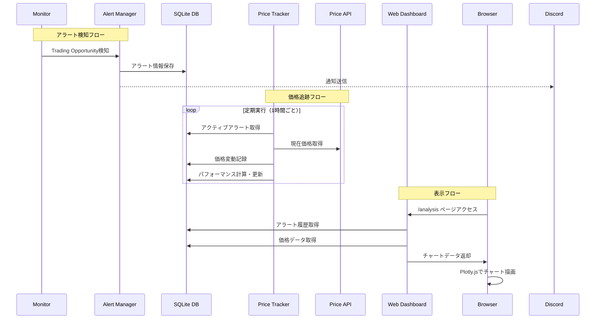
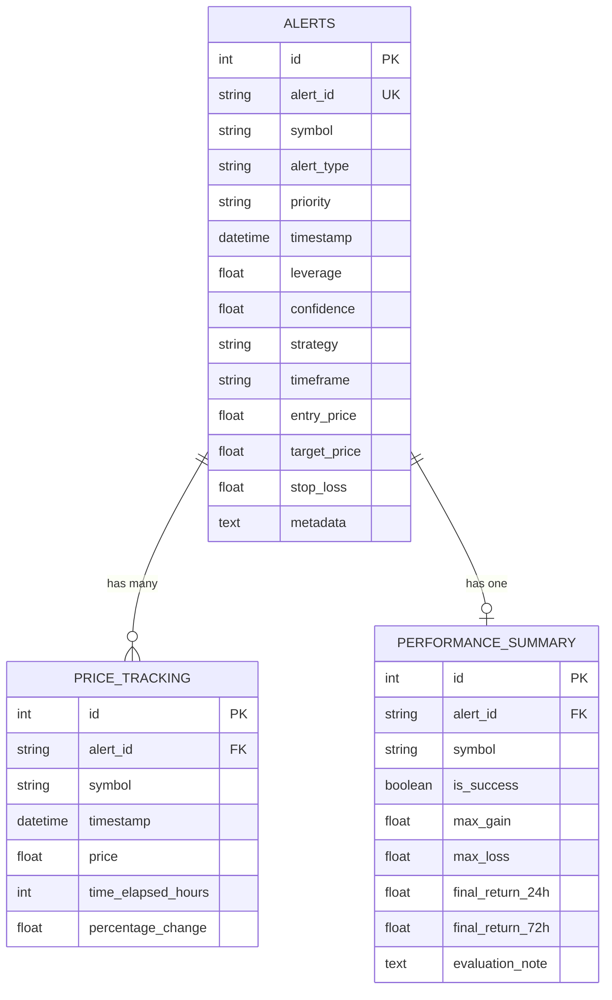
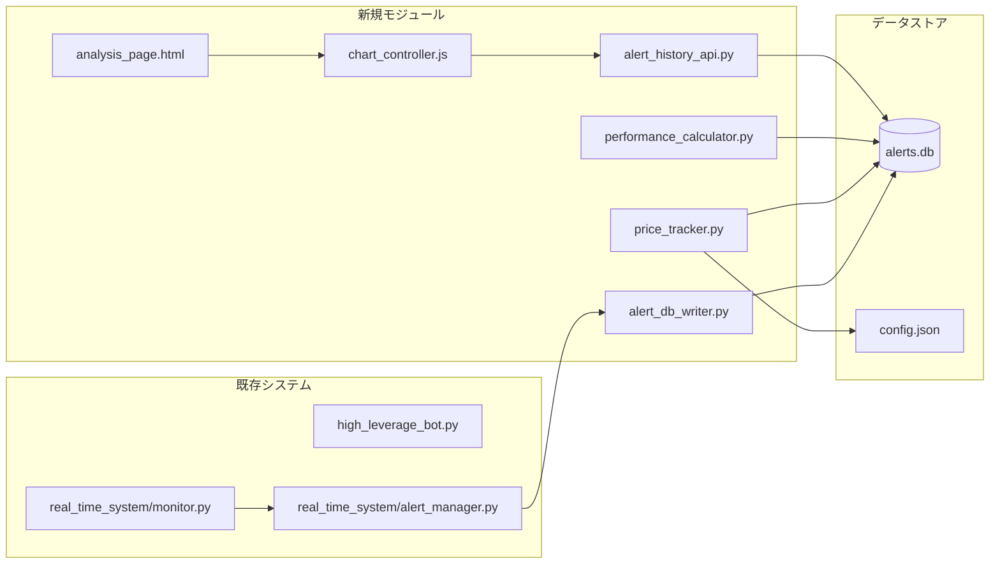
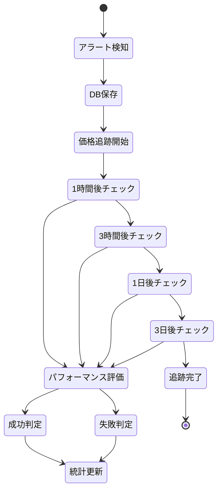

# 🏗️ アラート履歴分析システム アーキテクチャ図

## 📊 システム全体構成図

```mermaid
graph TB
    subgraph "リアルタイム監視システム"
        A[Real-time Monitor] --> B[Alert Manager]
        B --> C[Discord通知]
        B --> D[ログファイル]
    end
    
    subgraph "新規実装: アラート履歴システム"
        B --> E[Alert DB Writer]
        E --> F[(SQLite DB)]
        
        G[Price Tracker] --> H[Price API]
        G --> F
        
        I[Performance Calculator] --> F
    end
    
    subgraph "Webダッシュボード"
        J[Flask Server] --> K[/api/alerts/history]
        J --> L[/api/charts/data]
        J --> M[/api/performance/stats]
        
        K --> F
        L --> F
        M --> F
        
        N[Analysis Page] --> O[Plotly.js Charts]
        N --> P[Statistics Panel]
        N --> Q[Filter Controls]
    end
    
    subgraph "ユーザーインターフェース"
        R[Web Browser] --> N
        O --> S[価格チャート]
        O --> T[アラートマーカー]
        O --> U[成功/失敗表示]
    end
```

## 🔄 データフロー図



## 🗄️ データベース構造図



## 🎯 コンポーネント詳細図

```
┌─────────────────────────────────────────────────────────────┐
│                    アラート履歴分析システム                      │
├─────────────────────────────────────────────────────────────┤
│                                                             │
│  ┌─────────────┐     ┌─────────────┐     ┌─────────────┐  │
│  │   Monitor   │────▶│Alert Manager│────▶│  DB Writer  │  │
│  └─────────────┘     └─────────────┘     └──────┬──────┘  │
│                                                  │         │
│                                                  ▼         │
│  ┌─────────────┐     ┌─────────────┐     ┌─────────────┐  │
│  │Price Tracker│────▶│  Price API  │     │  SQLite DB  │  │
│  └──────┬──────┘     └─────────────┘     └──────▲──────┘  │
│         │                                        │         │
│         └────────────────────────────────────────┘         │
│                                                             │
│  ┌─────────────┐     ┌─────────────┐     ┌─────────────┐  │
│  │Web Dashboard│────▶│ Flask APIs  │────▶│Analysis Page│  │
│  └─────────────┘     └─────────────┘     └─────────────┘  │
│                                                             │
└─────────────────────────────────────────────────────────────┘
```

## 📱 画面構成図

```
┌───────────────────────────────────────────────────────┐
│  📊 アラート履歴分析ダッシュボード                        │
├───────────────────────────────────────────────────────┤
│ ┌─────────────┐ ┌──────────────┐ ┌─────────────────┐ │
│ │トークン選択▼│ │ 期間選択 ▼   │ │ 戦略フィルタ ▼ │ │
│ └─────────────┘ └──────────────┘ └─────────────────┘ │
├───────────────────────────────────────────────────────┤
│                                                       │
│  ┌─────────────────────────────────────────────────┐ │
│  │              📈 価格チャート                      │ │
│  │  $30┤                    🎯                     │ │
│  │     │                   ╱ ╲                     │ │
│  │  $25┤        🎯────────╱   ╲                   │ │
│  │     │       ╱                ╲                  │ │
│  │  $20┤──────╱          🎯      ╲                │ │
│  │     └─────────────────────────────────────────│ │
│  │      6/1    6/5    6/9    6/13    6/17        │ │
│  └─────────────────────────────────────────────────┘ │
│                                                       │
│  ┌──────────────────┐  ┌────────────────────────┐   │
│  │ 📊 統計サマリー   │  │ 📋 アラート詳細        │   │
│  ├──────────────────┤  ├────────────────────────┤   │
│  │ 成功率: 73%      │  │ 選択アラート情報表示    │   │
│  │ 平均リターン: 12% │  │ - 時刻、価格          │   │
│  │ 最高成果: 24.9%  │  │ - その後の価格推移     │   │
│  └──────────────────┘  └────────────────────────┘   │
└───────────────────────────────────────────────────────┘
```

## 🔧 モジュール関係図



## 🚀 処理シーケンス図

```
1. アラート検知・保存
   Monitor → Alert Manager → DB Writer → SQLite
   
2. 価格追跡（1時間ごと）
   Scheduler → Price Tracker → API → SQLite
   
3. パフォーマンス計算
   Price Tracker → Performance Calculator → SQLite
   
4. Web表示
   Browser → Flask → SQLite → JSON → Plotly.js
```

## 📊 状態遷移図



## 🎨 UI/UXフロー図

```
┌─────────┐     ┌────────────┐     ┌───────────┐
│Dashboard│────▶│Analysis Tab│────▶│Token Select│
└─────────┘     └────────────┘     └─────┬─────┘
                                          │
                                          ▼
┌─────────┐     ┌────────────┐     ┌───────────┐
│ Export  │◀────│Chart Display│◀────│Date Range │
└─────────┘     └──────┬─────┘     └───────────┘
                       │
                       ▼
                ┌────────────┐
                │Alert Detail│
                │  Popup     │
                └────────────┘
```

## 🔐 セキュリティ考慮事項

```
1. SQLインジェクション対策
   - パラメータバインディング使用
   - 入力値バリデーション

2. API レート制限
   - Price API呼び出し制限
   - キャッシュ活用

3. データアクセス制御
   - 読み取り専用ビュー
   - 機密情報マスキング
```