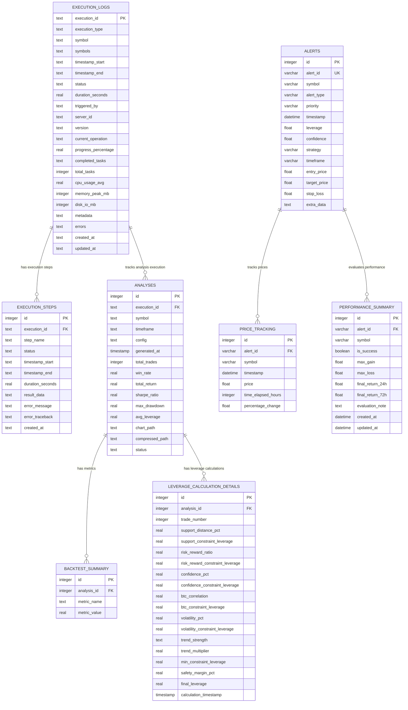

# Long Trader Database Schema - Entity Relationship Diagram

## Database Structure Overview

The Long Trader system uses multiple SQLite databases to manage different aspects of the trading analysis workflow:

1. **execution_logs.db** - Execution tracking and monitoring
2. **alert_history_system/data/alert_history.db** - Trading alerts and performance tracking  
3. **large_scale_analysis/analysis.db** - Strategy analysis results and backtest data

---

## Entity Relationship Diagram



---

## Database Details

### 1. Execution Logs Database (`execution_logs.db`)

**Primary Purpose**: Track system execution, monitoring, and orchestration activities

#### Tables:

##### `execution_logs`
- **Purpose**: Master execution tracking table
- **Key Fields**: 
  - `execution_id` (PK): Unique identifier for each execution
  - `execution_type`: Type of operation (SYMBOL_ADDITION, SCHEDULED_TRAINING, etc.)
  - `symbol/symbols`: Target symbol(s) for the operation
  - `status`: Current status (RUNNING, COMPLETED, FAILED, etc.)
  - `progress_percentage`: Completion percentage
- **Indexes**: execution_type, symbol, status, timestamp_start

##### `execution_steps`
- **Purpose**: Detailed step-by-step execution tracking
- **Key Fields**:
  - `execution_id` (FK): References execution_logs
  - `step_name`: Name of the execution step
  - `status`: Step status
  - `result_data`: Step output (JSON)
- **Relationship**: Many steps per execution

---

### 2. Alert History Database (`alert_history_system/data/alert_history.db`)

**Primary Purpose**: Store trading alerts and track their real-world performance

#### Tables:

##### `alerts`
- **Purpose**: Store trading signal alerts
- **Key Fields**:
  - `alert_id` (UK): Unique alert identifier
  - `symbol`: Trading symbol
  - `alert_type`: Type of alert (LONG_ENTRY, etc.)
  - `leverage`, `confidence`: Trading parameters
  - `entry_price`, `target_price`, `stop_loss`: Price levels

##### `price_tracking`
- **Purpose**: Track price movements after alerts
- **Key Fields**:
  - `alert_id` (FK): References alerts table
  - `time_elapsed_hours`: Hours since alert
  - `percentage_change`: Price change percentage
- **Relationship**: Multiple price points per alert

##### `performance_summary`
- **Purpose**: Evaluate alert performance over time
- **Key Fields**:
  - `alert_id` (FK): References alerts table
  - `is_success`: Whether alert was successful
  - `max_gain/max_loss`: Peak performance metrics
  - `final_return_24h/72h`: Returns at specific intervals
- **Relationship**: One summary per alert

---

### 3. Large Scale Analysis Database (`large_scale_analysis/analysis.db`)

**Primary Purpose**: Store strategy backtesting results and detailed analysis

#### Tables:

##### `analyses`
- **Purpose**: Store strategy backtest results
- **Key Fields**:
  - `execution_id` (FK): References execution_logs table
  - `symbol`, `timeframe`, `config`: Strategy parameters
  - `sharpe_ratio`, `win_rate`, `total_return`: Performance metrics
  - `chart_path`, `compressed_path`: File references
- **Indexes**: symbol_timeframe, config, sharpe_ratio, execution_id

##### `backtest_summary`
- **Purpose**: Store additional metrics for each analysis
- **Key Fields**:
  - `analysis_id` (FK): References analyses table
  - `metric_name`, `metric_value`: Custom metrics
- **Relationship**: Multiple metrics per analysis

##### `leverage_calculation_details`
- **Purpose**: Store detailed leverage calculation breakdown
- **Key Fields**:
  - `analysis_id` (FK): References analyses table
  - `trade_number`: Trade sequence number
  - Various constraint leverages and calculations
- **Relationship**: Multiple calculations per analysis

---

## Key Relationships

1. **Execution Tracking**: `execution_logs` → `execution_steps` (1:N)
2. **Execution to Analysis**: `execution_logs` → `analyses` (1:N)
3. **Alert Performance**: `alerts` → `price_tracking` (1:N) and `alerts` → `performance_summary` (1:1)
4. **Analysis Details**: `analyses` → `backtest_summary` (1:N) and `analyses` → `leverage_calculation_details` (1:N)

## Data Flow

1. **Symbol Addition**: Creates `execution_logs` entry → Generates `analyses` entries → Stores detailed `leverage_calculation_details`
2. **Alert Generation**: Creates `alerts` → Continuous `price_tracking` → Final `performance_summary`
3. **Strategy Results**: Query `analyses` with filters → Load compressed trade data → Display in web dashboard

## Storage Locations

```
/Users/moriwakikeita/tools/long-trader/
├── execution_logs.db                           # Main execution tracking
├── alert_history_system/data/alert_history.db  # Alert performance tracking
└── large_scale_analysis/analysis.db            # Strategy analysis results
```

---

## Additional Database Indexes

**Performance Optimization Indexes (not shown in ER diagram above):**

### execution_logs.db
- `idx_execution_logs_symbol` on execution_logs(symbol)
- `idx_execution_logs_status` on execution_logs(status)
- `idx_execution_logs_type` on execution_logs(execution_type)
- `idx_execution_logs_timestamp` on execution_logs(timestamp_start)

### analysis.db
- `idx_analyses_execution_id` on analyses(execution_id)
- `idx_analyses_symbol` on analyses(symbol)
- `idx_analyses_generated_at` on analyses(generated_at)
- `idx_analyses_config` on analyses(config)
- `idx_analyses_sharpe_ratio` on analyses(sharpe_ratio)
- `idx_leverage_analysis` on leverage_calculation_details(analysis_id)
- `idx_leverage_trade` on leverage_calculation_details(analysis_id, trade_number)

### alert_history.db
- SQLAlchemy automatically manages indexes for primary keys and unique constraints