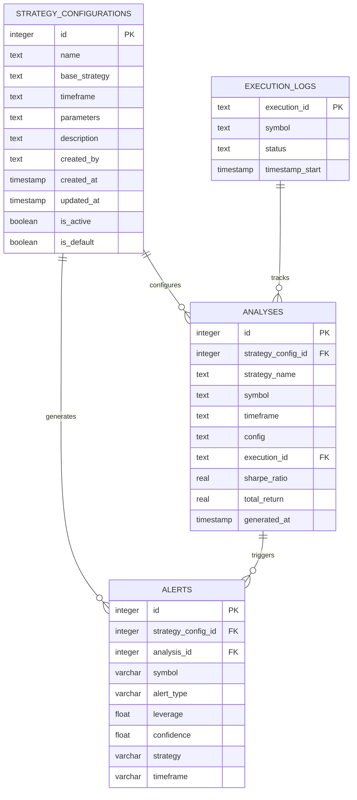

# 戦略カスタマイズ機能設計提案

## 現状の問題点

### 1. 実行範囲の問題
- 銘柄追加時に全時間足×全戦略の組み合わせを実行（重い処理）
- ユーザーが選択した条件のみ実行したい

### 2. 戦略パラメータの制限
- 現在の `analyses.config` は固定戦略名のみ（Conservative_ML, Aggressive_ML等）
- パラメータカスタマイズができない
- 同一戦略の異なるパラメータでの比較ができない

---

## 提案設計

### 新テーブル: `strategy_configurations`

戦略とそのパラメータを管理する中核テーブル

```sql
CREATE TABLE strategy_configurations (
    id INTEGER PRIMARY KEY AUTOINCREMENT,
    name TEXT NOT NULL,                    -- ユーザー定義名 "攻撃的BTC戦略v2"
    base_strategy TEXT NOT NULL,           -- Conservative_ML, Aggressive_ML等
    timeframe TEXT NOT NULL,               -- 15m, 30m, 1h等
    parameters TEXT NOT NULL,              -- JSON形式のパラメータ
    description TEXT,                      -- 戦略の説明
    created_by TEXT DEFAULT 'system',     -- 作成者
    created_at TIMESTAMP DEFAULT CURRENT_TIMESTAMP,
    updated_at TIMESTAMP DEFAULT CURRENT_TIMESTAMP,
    is_active BOOLEAN DEFAULT 1,          -- アクティブフラグ
    is_default BOOLEAN DEFAULT 0,         -- デフォルト戦略フラグ
    
    UNIQUE(name, base_strategy, timeframe)
);
```

#### パラメータ例（JSON形式）
```json
{
  "risk_multiplier": 1.3,
  "confidence_boost": -0.05,
  "leverage_cap": 80,
  "min_risk_reward": 1.2,
  "stop_loss_percent": 4.5,
  "take_profit_percent": 11.0,
  "custom_sltp_calculator": "CustomSLTPCalculator",
  "additional_filters": {
    "min_volume_usd": 2000000,
    "btc_correlation_max": 0.8
  }
}
```

### 修正テーブル: `analyses`

既存テーブルに戦略設定への参照を追加

```sql
-- 新カラム追加
ALTER TABLE analyses ADD COLUMN strategy_config_id INTEGER;
ALTER TABLE analyses ADD COLUMN strategy_name TEXT; -- 表示用

-- 外部キー制約（SQLiteでは後付けが困難なため、新規作成時に設定）
-- FOREIGN KEY (strategy_config_id) REFERENCES strategy_configurations(id)

-- 既存データとの互換性のため、configカラムは残す
-- 新しいレコードでは strategy_config_id を必須とする
```

### 修正テーブル: `alerts`

戦略設定との紐づけを追加

```sql
-- アラートが特定の戦略設定から生成されたことを記録
ALTER TABLE alerts ADD COLUMN strategy_config_id INTEGER;
ALTER TABLE alerts ADD COLUMN analysis_id INTEGER;

-- どちらかの参照を必須とする（analysis経由またはstrategy_config直接）
```

---

## データフロー

### 1. 戦略設定作成
```
ユーザー → Web UI → strategy_configurations テーブル
1. 基本戦略選択（Conservative_ML等）
2. 時間足選択
3. パラメータカスタマイズ
4. 戦略名設定・保存
```

### 2. 銘柄追加（改善後）
```
ユーザー選択 → 指定された戦略・時間足のみ実行
1. 銘柄選択: BTC
2. 戦略選択: "攻撃的BTC戦略v2" (id=5)
3. 実行 → analyses テーブルに strategy_config_id=5 で保存
```

### 3. アラート生成
```
analyses結果 → alerts作成時に strategy_config_id を記録
→ アラートの戦略トレーサビリティ確保
```

---

## 新しいER図



---

## 実装フェーズ

### Phase 1: データベース準備
1. `strategy_configurations` テーブル作成
2. 既存戦略をデフォルト設定として登録
3. マイグレーションスクリプト作成

### Phase 2: 戦略管理機能
1. 戦略CRUD API実装
2. Web UI での戦略作成・編集画面
3. パラメータバリデーション

### Phase 3: 銘柄追加改善
1. 戦略選択機能追加
2. 選択的実行ロジック実装
3. 既存analyses テーブルとの互換性維持

### Phase 4: アラート連携
1. アラート生成時の戦略記録
2. 戦略別パフォーマンス分析
3. 戦略比較ダッシュボード

---

## 利点

### 1. パフォーマンス向上
- 必要な戦略・時間足のみ実行 → 大幅な処理時間短縮
- ユーザーが関心のある条件に集中

### 2. カスタマイズ性
- 細かいパラメータ調整が可能
- A/Bテスト的な戦略比較
- 市場条件に応じた戦略最適化

### 3. 運用性
- 戦略の履歴管理
- 成功戦略の共有・再利用
- アラートの戦略トレーサビリティ

### 4. 拡張性
- 新しいパラメータの追加が容易
- 機械学習モデルのハイパーパラメータ管理
- 戦略のバージョン管理

---

## 実装例

### 戦略設定作成API
```python
@app.route('/api/strategy-config', methods=['POST'])
def create_strategy_config():
    data = request.json
    
    config = {
        'name': data['name'],
        'base_strategy': data['base_strategy'],
        'timeframe': data['timeframe'],
        'parameters': json.dumps(data['parameters']),
        'description': data.get('description', '')
    }
    
    # バリデーション
    if not validate_strategy_parameters(data['parameters']):
        return jsonify({'error': 'Invalid parameters'}), 400
    
    # DB保存
    strategy_id = strategy_config_db.create(config)
    return jsonify({'strategy_id': strategy_id})
```

### 銘柄追加改善
```python
@app.route('/api/symbol/add', methods=['POST'])
def add_symbol():
    data = request.json
    symbol = data['symbol']
    strategy_ids = data['strategy_config_ids']  # 選択された戦略ID群
    
    # 指定された戦略のみ実行
    for strategy_id in strategy_ids:
        strategy_config = get_strategy_config(strategy_id)
        execute_analysis(symbol, strategy_config)
```

---

## マイグレーション戦略

### 既存データの互換性
1. `analyses.config` カラムは保持
2. 既存データには対応するデフォルト戦略設定を作成
3. 段階的に新システムに移行

### デフォルト戦略設定
```sql
-- 既存戦略をstrategy_configurationsに登録
INSERT INTO strategy_configurations (name, base_strategy, timeframe, parameters, is_default) VALUES
('Conservative ML - 15m', 'Conservative_ML', '15m', '{"risk_multiplier": 0.8, "confidence_boost": 0.0}', 1),
('Aggressive ML - 1h', 'Aggressive_ML', '1h', '{"risk_multiplier": 1.2, "confidence_boost": -0.05}', 1);
```

この設計により、柔軟で効率的な戦略管理システムが実現できます。